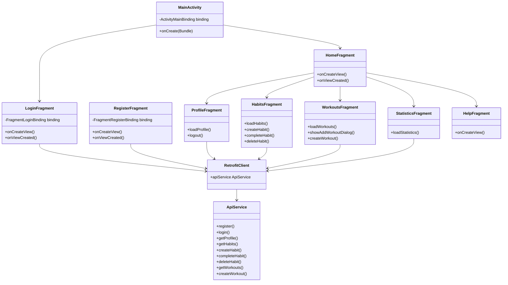

# UML-диаграмма Android-приложения

```mermaid
classDiagram
    class MainActivity {
        -ActivityMainBinding binding
        +onCreate(Bundle)
    }

    class LoginFragment {
        -FragmentLoginBinding binding
        +onCreateView()
        +onViewCreated()
    }

    class RegisterFragment {
        -FragmentRegisterBinding binding
        +onCreateView()
        +onViewCreated()
    }

    class HomeFragment {
        +onCreateView()
        +onViewCreated()
    }

    class ProfileFragment {
        +loadProfile()
        +logout()
    }

    class HabitsFragment {
        +loadHabits()
        +createHabit()
        +completeHabit()
        +deleteHabit()
    }

    class WorkoutsFragment {
        +loadWorkouts()
        +showAddWorkoutDialog()
        +createWorkout()
    }

    class StatisticsFragment {
        +loadStatistics()
    }

    class HelpFragment {
        +onCreateView()
    }

    class RetrofitClient {
        +apiService ApiService
    }

    class ApiService {
        +register()
        +login()
        +getProfile()
        +getHabits()
        +createHabit()
        +completeHabit()
        +deleteHabit()
        +getWorkouts()
        +createWorkout()
    }

    MainActivity --> LoginFragment
    MainActivity --> HomeFragment

    LoginFragment --> RetrofitClient
    RegisterFragment --> RetrofitClient
    ProfileFragment --> RetrofitClient
    HabitsFragment --> RetrofitClient
    WorkoutsFragment --> RetrofitClient
    StatisticsFragment --> RetrofitClient

    RetrofitClient --> ApiService

    HomeFragment --> ProfileFragment
    HomeFragment --> HabitsFragment
    HomeFragment --> WorkoutsFragment
    HomeFragment --> StatisticsFragment
    HomeFragment --> HelpFragment
```

Диаграмма показывает основные экраны приложения и их взаимодействие с Retrofit и REST API.