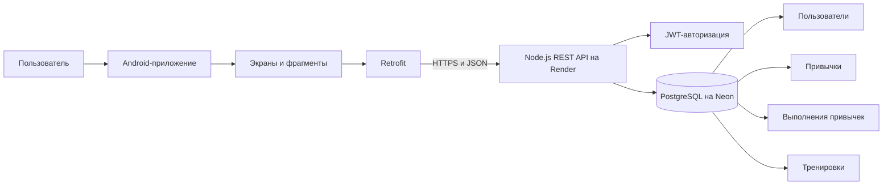

# Архитектура ActiveHabit

```mermaid
flowchart LR
    User[Пользователь] --> Android[Android-приложение]

    Android --> UI[Экраны и фрагменты]
    UI --> Retrofit[Retrofit]

    Retrofit -->|HTTPS и JSON| API[Node.js REST API на Render]

    API --> Auth[JWT-авторизация]
    API --> Database[(PostgreSQL на Neon)]

    Database --> Users[Пользователи]
    Database --> Habits[Привычки]
    Database --> Completions[Выполнения привычек]
    Database --> Workouts[Тренировки]
```

Android-приложение отправляет запросы серверу через Retrofit. Сервер проверяет JWT-токен и работает с удалённой базой PostgreSQL.