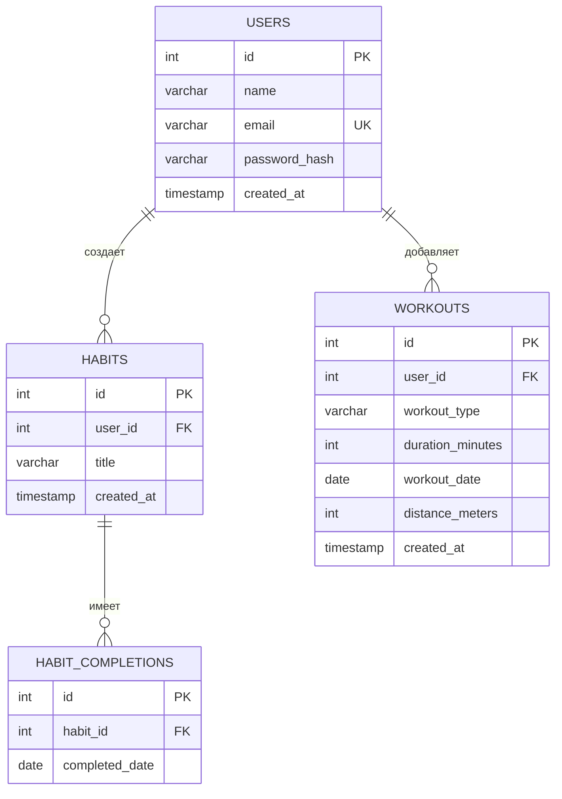

# ER-диаграмма базы данных

```mermaid
erDiagram
    USERS ||--o{ HABITS : создает
    USERS ||--o{ WORKOUTS : добавляет
    HABITS ||--o{ HABIT_COMPLETIONS : имеет

    USERS {
        int id PK
        varchar name
        varchar email UK
        varchar password_hash
        timestamp created_at
    }

    HABITS {
        int id PK
        int user_id FK
        varchar title
        timestamp created_at
    }

    HABIT_COMPLETIONS {
        int id PK
        int habit_id FK
        date completed_date
    }

    WORKOUTS {
        int id PK
        int user_id FK
        varchar workout_type
        int duration_minutes
        date workout_date
        int distance_meters
        timestamp created_at
    }
```

Один пользователь может создать несколько привычек и тренировок. Одна привычка может иметь несколько отметок выполнения.