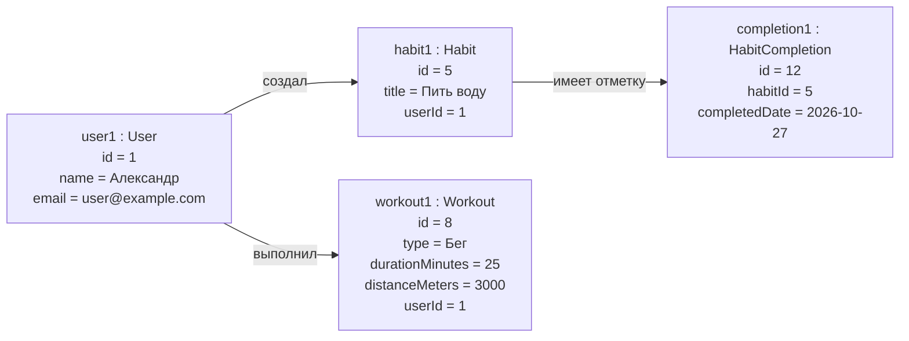

# Объектная диаграмма ActiveHabit

```mermaid
flowchart LR
    User["user1 : User<br/>id = 1<br/>name = Александр<br/>email = user@example.com"]

    Habit["habit1 : Habit<br/>id = 5<br/>title = Пить воду<br/>userId = 1"]

    Completion["completion1 : HabitCompletion<br/>id = 12<br/>habitId = 5<br/>completedDate = 2026-10-27"]

    Workout["workout1 : Workout<br/>id = 8<br/>type = Бег<br/>durationMinutes = 25<br/>distanceMeters = 3000<br/>userId = 1"]

    User -->|создал| Habit
    Habit -->|имеет отметку| Completion
    User -->|выполнил| Workout
```

Диаграмма показывает пример конкретных объектов системы. Пользователь создал привычку «Пить воду», отметил её выполнение и добавил пробежку на 3000 метров.